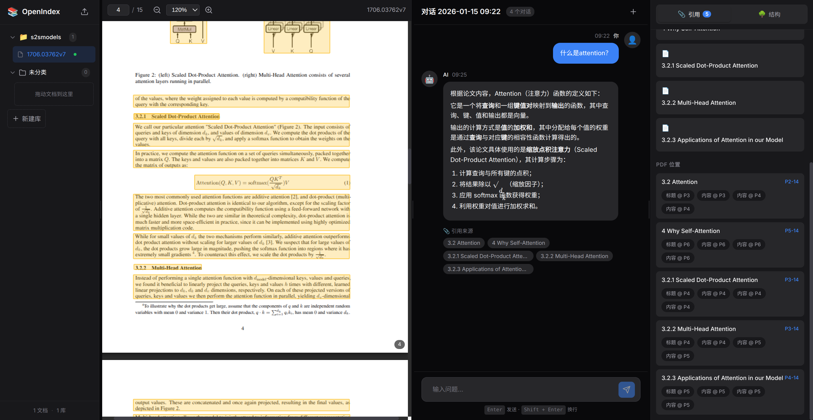

# OpenIndex - AI 驱动的智能论文阅读系统

> 🎨 **Vibe-Coded with Cursor** | 灵感来源于 [PageIndex](https://github.com/VectifyAI/PageIndex) | 使用 [MinerU](https://github.com/opendatalab/MinerU) 进行 PDF 解析

一个基于 AI 的智能论文阅读和检索系统，能够将 PDF 论文转换为结构化树，并通过自然语言查询实现精准定位和智能问答。

## ✨ 项目特色

- 🚀 **Vibe-Coding 开发**：使用 Cursor AI 的 vibe-coding 模式快速迭代开发
- 📄 **MinerU 集成**：使用 MinerU 进行高精度 PDF 解析，支持双栏布局、公式、表格等复杂结构
- 🌳 **智能树结构**：将 PDF 转换为分层树结构，支持节点摘要和树剪枝
- 🔍 **AI 检索**：基于 LLM 的两阶段检索流程，实现精准的文档定位
- 📍 **PDF 定位**：查询结果可直接定位到 PDF 的精确位置（页码 + bbox 坐标）
- 💬 **对话式交互**：支持多轮对话，保留上下文和历史记录
- 🎨 **现代化前端**：Vue 3 + TypeScript + Vite 构建的响应式 Web 界面

## 🏗️ 项目架构

```
PageIndex/
├── md2tree/                    # 核心转换模块
│   ├── core/                   # 核心功能
│   │   ├── converter.py        # Markdown → 树结构转换
│   │   ├── tree.py             # 树操作工具
│   │   └── workflow.py         # 完整工作流
│   ├── llm/                    # LLM 集成
│   │   ├── client.py           # LLM API 客户端
│   │   ├── summary.py          # 节点摘要生成
│   │   └── thinning.py         # 树剪枝算法
│   ├── parsers/                # 解析器
│   │   ├── mineru.py           # MinerU 解析器（核心）
│   │   └── middle_json.py     # Middle JSON 解析器
│   ├── pdf/                    # PDF 处理
│   │   ├── coordinates.py      # 坐标转换
│   │   └── viewer.py           # PDF 查看器
│   └── openindex/              # Web 应用
│       ├── app.py              # FastAPI 后端
│       ├── frontend/           # Vue 3 前端
│       ├── database.py         # SQLite 数据库
│       ├── parser_service.py   # PDF 解析服务
│       └── query_service.py   # 智能查询服务
└── docs/                       # 项目文档
```

## 🔄 核心工作流

### 1. PDF 解析流程

```
┌─────────────────────────────────────────────────────────────────────────────┐
│                          PDF 解析完整流程                                     │
└─────────────────────────────────────────────────────────────────────────────┘

1️⃣ PDF 上传阶段
   │
   └─► 用户上传 PDF 文件
       ├─► 文件验证（格式、大小、文件头）
       ├─► 生成唯一文档 ID (8位十六进制)
       ├─► 保存原始 PDF 到 data/documents/{doc_id}/
       └─► 在数据库创建文档记录，状态设为 "pending"

2️⃣ MinerU 解析阶段 (状态: parsing_mineru)
   │
   └─► 调用 MinerU 服务解析 PDF
       ├─► 输入: PDF 文件
       ├─► 输出:
       │   ├── *_middle.json      (精确坐标信息)
       │   ├── *_content_list.json (内容列表)
       │   ├── *.md               (Markdown 格式)
       │   └── images/            (提取的图片)
       └─► 保存到 data/documents/{doc_id}/mineru_output/

3️⃣ Markdown 转树结构阶段 (状态: parsing_markdown)
   │
   └─► 解析 Markdown 文件
       ├─► 提取标题层级 (#, ##, ### ...)
       ├─► 构建树形结构
       │   ├── 每个节点包含:
       │   │   ├── node_id: 唯一标识
       │   │   ├── type: 节点类型 (title/paragraph/list/table/code)
       │   │   ├── level: 标题层级 (1-6)
       │   │   ├── content: 文本内容
       │   │   └── children: 子节点数组
       │   └── 支持树剪枝（可选）
       └─► 保存到 data/documents/{doc_id}/tree.json

4️⃣ 位置信息映射阶段 (状态: adding_locations)
   │
   └─► 将 PDF 坐标映射到树节点
       ├─► 从 middle.json 读取坐标信息
       ├─► 为每个节点添加位置信息:
       │   ├── page_idx: 页码
       │   └── bbox: 边界框 [x0, y0, x1, y1]
       └─► 更新 tree.json

5️⃣ 完成阶段 (状态: ready)
   │
   └─► 文档解析完成
       ├─► 更新数据库状态为 "ready"
       ├─► 记录解析统计信息（节点数、页数等）
       └─► 可以开始查询

═══════════════════════════════════════════════════════════════════════════════

数据存储结构:
data/documents/{doc_id}/
├── original.pdf              # 原始 PDF 文件
├── document.md               # Markdown 格式
├── tree.json                 # 结构化树 + 位置信息
├── metadata.json             # 文档元数据
└── mineru_output/           # MinerU 解析输出
    ├── *_middle.json        # 精确坐标
    ├── *_content_list.json  # 内容列表
    └── images/              # 提取的图片

状态转换:
pending → parsing_mineru → parsing_markdown → adding_locations → ready
                                    ↓
                                 error
```

### 2. 智能查询流程

```
┌─────────────────────────────────────────────────────────────────────────────┐
│                          智能查询完整流程                                     │
└─────────────────────────────────────────────────────────────────────────────┘

1️⃣ 用户发起查询
   │
   └─► 用户输入自然语言问题
       ├─► 提供文档 ID (doc_id)
       ├─► 提供查询文本 (query)
       └─► 可选：提供对话 ID (conversation_id) 用于上下文

2️⃣ 节点选择阶段 (LLM 第一步)
   │
   └─► 调用 LLM 选择相关节点
       ├─► 输入:
       │   ├── 用户查询
       │   ├── 文档树结构 (所有节点的标题和摘要)
       │   └── 对话历史 (如果有)
       ├─► Prompt: "请选择与查询最相关的 {top_k} 个节点"
       └─► 输出: 相关节点 ID 列表

3️⃣ 原文提取阶段
   │
   └─► 从树结构提取完整文本
       ├─► 根据 node_id 定位节点
       ├─► 提取节点的完整 content
       └─► 收集所有相关节点的文本

4️⃣ 答案生成阶段 (LLM 第二步)
   │
   └─► 调用 LLM 生成答案
       ├─► 输入:
       │   ├── 用户查询
       │   ├── 提取的原文内容
       │   └── 对话历史 (如果有)
       ├─► Prompt: "基于以下内容回答问题"
       └─► 输出:
           ├── answer: 生成的答案
           └── 引用的节点列表

5️⃣ PDF 定位阶段
   │
   └─► 映射到 PDF 坐标
       ├─► 从节点获取位置信息
       │   ├── page_idx: 页码
       │   └── bbox: 边界框 [x0, y0, x1, y1]
       └─► 在前端 PDF 查看器中高亮显示

6️⃣ 对话保存阶段 (可选)
   │
   └─► 保存到数据库
       ├─► 创建或获取对话 (conversation)
       ├─► 保存用户消息
       ├─► 保存 AI 回复
       └─► 关联引用的节点信息

═══════════════════════════════════════════════════════════════════════════════

查询响应结构:
{
  "answer": "LLM 生成的答案",
  "sources": [
    {
      "node_id": "1.2.3",
      "content": "引用的文本内容",
      "page_idx": 5,
      "bbox": [100, 200, 400, 250]
    }
  ],
  "conversation_id": "conv-uuid",
  "message_id": 123
}

性能优化:
- 查询结果缓存 (TTL: 1小时)
- 解析器缓存 (LRU, 最大50个)
- 并发控制 (默认最多2个并发解析任务)
```

## 🚀 快速开始

### 环境要求

- Python 3.8+
- Node.js 18+ (前端开发)
- MinerU 服务（可本地部署或使用在线 API）

### 安装步骤

1. **克隆项目**

```bash
git clone <repository-url>
cd PageIndex
```

2. **安装 Python 依赖**

```bash
# 创建虚拟环境
python -m venv .venv
source .venv/bin/activate  # Linux/Mac
# 或 .venv\Scripts\activate  # Windows

# 安装依赖
pip install -r requirements.txt
# 或使用 uv
uv pip install -r requirements.txt
```

3. **配置环境变量**

创建 `.env` 文件：

```env
# LLM API 配置（智谱 AI 或 OpenAI）
ZHIPU_API_KEY=your_api_key
ZHIPU_API_BASE=https://open.bigmodel.cn/api/coding/paas/v4
ZHIPU_MODEL=glm-4.7

# 或使用 OpenAI
OPENAI_API_KEY=your_api_key
OPENAI_API_BASE=https://api.openai.com/v1
OPENAI_MODEL=gpt-4o

# MinerU 配置
MINERU_SERVER_URL=http://localhost:30909
MINERU_API_URL=http://localhost:30909
```

4. **配置 MinerU**

编辑 `md2tree/config.toml`：

```toml
[mineru]
server_url = ""  # 留空则使用环境变量 MINERU_SERVER_URL
api_url = ""     # 留空则使用环境变量 MINERU_API_URL
backend = "vlm-http-client"
executable = "mineru"
```

5. **安装前端依赖**

```bash
cd md2tree/openindex/frontend
npm install
```

### 启动服务

#### 方式一：使用启动脚本（推荐）

```bash
# 同时启动前后端
./start_all.sh

# 或分别启动
./start_backend.sh   # 启动后端 (端口 8090)
./start_frontend.sh  # 启动前端 (端口 5173)
```

#### 方式二：手动启动

```bash
# 启动后端
cd md2tree/openindex
python -m md2tree.openindex.app

# 启动前端（新终端）
cd md2tree/openindex/frontend
npm run dev
```

访问 `http://localhost:5173` 开始使用！

## 📖 使用指南

### Web 界面使用

1. **上传 PDF**
   - 点击上传按钮，选择 PDF 文件
   - 系统自动调用 MinerU 进行解析

2. **等待解析完成**
   - 解析状态会实时更新
   - 完成后文档状态变为 "ready"

3. **开始对话**
   - 在聊天界面输入问题
   - 系统会返回答案并高亮 PDF 中的相关位置

4. **查看引用**
   - 点击答案中的引用节点
   - PDF 会自动跳转到对应位置并高亮

### Python API 使用

```python
from md2tree.openindex.document_store import DocumentStore
from md2tree.openindex.parser_service import ParserService
from md2tree.openindex.query_service import QueryService

# 初始化服务
store = DocumentStore()
parser = ParserService(store)
query_service = QueryService(store)

# 解析 PDF
result = await parser.parse_document("doc_id")

# 查询文档
response = await query_service.query(
    doc_id="doc_id",
    query="这篇论文的主要贡献是什么？",
    top_k=5
)

print(response.answer)
print(response.sources)  # 包含 PDF 坐标信息
```

## 🛠️ 技术栈

### 后端
- **FastAPI** - 现代化 Web 框架
- **SQLite** - 轻量级数据库
- **MinerU** - PDF 解析引擎
- **LLM API** - 支持智谱 AI、OpenAI 等

### 前端
- **Vue 3** - 渐进式 JavaScript 框架
- **TypeScript** - 类型安全的 JavaScript
- **Vite** - 快速构建工具
- **Pinia** - 状态管理
- **PDF.js** - PDF 渲染和高亮

### 核心功能
- **md2tree** - Markdown 到树结构转换
- **树剪枝** - 智能合并小节点
- **节点摘要** - AI 驱动的摘要生成
- **坐标转换** - PDF 坐标系统转换

## 📚 文档

- [架构文档](md2tree/docs/ARCHITECTURE.md) - 系统架构和设计
- [API 文档](md2tree/docs/API.md) - API 接口说明
- [开发文档](md2tree/docs/DEVELOPMENT.md) - 开发指南
- [坐标转换](md2tree/docs/COORDINATE_TRANSFORM.md) - PDF 坐标系统说明

## 🎯 核心特性详解

### MinerU 集成

使用 MinerU 进行 PDF 解析的优势：

- ✅ **高精度解析**：支持双栏布局、公式、表格等复杂结构
- ✅ **坐标信息**：自动提取 `page_idx` 和 `bbox` 坐标
- ✅ **多种输出**：支持 `middle.json`、`content_list.json` 和 Markdown
- ✅ **灵活部署**：支持本地部署和在线 API

### 智能树结构

- **分层组织**：基于标题层级自动构建树结构
- **节点摘要**：使用 LLM 为每个节点生成摘要
- **树剪枝**：智能合并小节点，降低复杂度
- **位置映射**：每个节点关联 PDF 坐标信息

### AI 检索流程

1. **节点选择**：使用 LLM 从树结构中选择相关节点
2. **原文提取**：获取选中节点的完整文本内容
3. **答案生成**：基于原文和查询生成答案
4. **定位返回**：返回答案和 PDF 定位信息

## 🔧 配置说明

### LLM 配置

支持通过环境变量或配置文件设置：

```toml
[llm]
api_key = ""  # 留空则使用环境变量
api_base = ""  # 留空则使用环境变量
model = "glm-4.7"
max_concurrent_requests = 5
request_timeout = 120
```

### MinerU 配置

```toml
[mineru]
server_url = ""  # 留空则使用环境变量 MINERU_SERVER_URL
api_url = ""      # 留空则使用环境变量 MINERU_API_URL
backend = "vlm-http-client"
executable = "mineru"
```

## 🧪 测试

```bash
# 运行所有测试
cd md2tree/tests
pytest -v

# 运行特定测试
pytest test_api_integration.py
pytest test_retrieval.py
```

## ⚠️ 当前不足与限制

### 性能相关

1. **查询延迟较高**
   - 两阶段 LLM 查询流程需要两次 API 调用，总延迟通常在 3-10 秒
   - 大文档的树结构序列化耗时较长
   - 缺少查询结果缓存机制

2. **PDF 解析性能**
   - MinerU 解析大文件（>100页）可能需要数分钟
   - 解析过程是同步阻塞的，无法实时反馈进度
   - 解析结果占用大量存储空间

3. **数据库查询优化**
   - SQLite 在大数据量下性能有限
   - 缺少索引优化和查询优化
   - 树结构以 JSON 形式存储，查询效率低

### 功能缺失

1. **PDF 管理功能不足**
   - ❌ 缺少批量上传和管理
   - ❌ 无法对 PDF 进行分类和标签管理
   - ❌ 缺少 PDF 搜索和筛选功能
   - ❌ 无法批量删除或归档
   - ❌ 缺少 PDF 元数据管理（作者、日期、标签等）

2. **对话历史与标注管理**
   - ❌ 对话历史中的 PDF 标注无法持久化保存
   - ❌ 无法管理、编辑或删除已保存的标注
   - ❌ 标注无法跨对话共享
   - ❌ 缺少标注的导出和导入功能
   - ❌ 无法为标注添加笔记或评论

3. **用户体验**
   - ❌ 缺少解析进度条和实时反馈
   - ❌ 查询时没有加载状态提示
   - ❌ 错误信息不够友好
   - ❌ 缺少快捷键支持

### 架构限制

1. **存储限制**
   - SQLite 不适合大规模部署
   - 文件系统存储缺少版本控制
   - 缺少数据备份和恢复机制

2. **并发处理**
   - 解析任务并发数有限（默认 2 个）
   - LLM 请求并发控制可能不够灵活
   - 缺少任务队列和异步处理

3. **扩展性**
   - 单机部署，无法水平扩展
   - 缺少分布式存储支持
   - 无法支持多用户和权限管理

## 🚀 未来规划

### 短期目标（1-2 个月）

#### 1. PDF 管理功能增强

- [ ] **批量上传和管理**
  - 支持拖拽批量上传
  - 上传队列管理和进度显示
  - 批量删除和归档功能

- [ ] **分类和标签系统**
  - 支持自定义分类和标签
  - 多标签筛选和搜索
  - 标签自动推荐

- [ ] **PDF 元数据管理**
  - 自动提取 PDF 元数据（标题、作者、日期等）
  - 支持手动编辑元数据
  - 基于元数据的搜索和排序

- [ ] **高级搜索功能**
  - 全文搜索（基于树结构）
  - 按日期、大小、状态筛选
  - 保存搜索条件

#### 2. 对话历史与 PDF 标注管理

- [ ] **标注持久化**
  - 将对话中的 PDF 标注保存到数据库
  - 支持标注的增删改查
  - 标注与对话历史关联

- [ ] **标注管理界面**
  - 标注列表和筛选
  - 标注编辑和删除
  - 标注导出（JSON/PDF）

- [ ] **标注共享**
  - 标注跨对话共享
  - 标注笔记和评论功能
  - 标注分类和标签

- [ ] **标注可视化**
  - 在 PDF 中显示所有标注
  - 标注时间线视图
  - 标注统计和分析

#### 3. 性能优化

- [ ] **查询性能优化**
  - 实现查询结果缓存（Redis/Memory）
  - 优化树结构序列化
  - 减少 LLM API 调用次数

- [ ] **解析性能优化**
  - 实现异步解析和进度反馈
  - 解析结果压缩存储
  - 增量解析支持

- [ ] **数据库优化**
  - 添加必要的索引
  - 查询优化和分页
  - 考虑迁移到 PostgreSQL

- [ ] **前端性能优化**
  - 虚拟滚动（大列表）
  - 懒加载和代码分割
  - 减少不必要的重渲染

### 中期目标（3-6 个月）

- [ ] **多用户支持**
  - 用户认证和授权
  - 个人文档库
  - 共享和协作功能

- [ ] **高级检索功能**
  - 向量检索（Embedding）
  - 混合检索（关键词 + 向量）
  - 检索结果排序优化

- [ ] **导出和集成**
  - 导出为 Markdown/PDF
  - API 集成支持
  - Webhook 通知

- [ ] **监控和日志**
  - 性能监控（Prometheus）
  - 错误追踪（Sentry）
  - 使用分析

### 长期目标（6+ 个月）

- [ ] **分布式部署**
  - 支持多节点部署
  - 分布式存储（S3/MinIO）
  - 负载均衡

- [ ] **AI 功能增强**
  - 文档自动摘要
  - 智能推荐相关文档
  - 多文档联合查询

- [ ] **移动端支持**
  - 响应式设计优化
  - PWA 支持
  - 移动端原生应用

## 🤝 致谢

- **PageIndex** - 项目灵感来源
- **MinerU** - 强大的 PDF 解析工具
- **Cursor** - Vibe-Coding 开发体验

## 📝 开发说明

本项目使用 **Cursor AI 的 Vibe-Coding 模式**开发，通过自然语言描述快速迭代和实现功能。整个开发过程体现了 AI 辅助编程的强大能力，从架构设计到功能实现，都得到了 AI 的深度参与。

### 开发历程

- ✅ 核心转换模块（md2tree）
- ✅ MinerU 集成和坐标处理
- ✅ LLM 驱动的智能检索
- ✅ Web 应用前后端开发
- ✅ 数据库设计和版本管理
- ✅ 前端状态管理和持久化
- ✅ 完整的测试覆盖

## 📄 许可证

本项目基于 PageIndex 的灵感开发，使用 MinerU 进行 PDF 解析。

---

**Built with ❤️ using Cursor Vibe-Coding**
